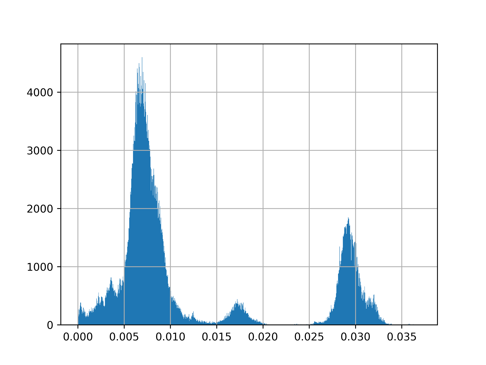

# GRUMPS
***G***enomic distance based ***R***apid ***U***ncovering of ***M***icrobial ***P***opulation ***S***tructures.

**GRUMPS** is designed to assist and speed up the construction of species level population structures using Mash distances as an input. ANI values can be used as well if the ANI values are converted to a decimal difference value {i.e. (100 - ANIvalue) /100}. Additional helper scripts are provided if you do not have a correctly formatted distance matrix to input.

**GRUMPS** reads a normalized distance matrix and returns a filtered result. It can be run in 'summary', 'regular', 'strict', 'sigma', 'target',
'clique', and 'small' modes. For more information about these modes please see the white paper:
https://doi.org/10.1101/2022.12.19.521123


## Installation

**GRUMPS** is installable from pip, conda or from this repository. Note the pip version does not have the R dependecies needed for **r_grumps**. The best installation option for **GRUMPS** is conda. 

The easiest way to install **GRUMPS** is using conda to create an environment. Using [mamba](https://mamba.readthedocs.io/en/latest/) as a replacement for conda can spead up the environment creation process.

1. **Clone this repo and change directories to the local clone**
2. **Create a conda environment using environment.yml:** `conda env create -f ./environment.yml`

The following commands would install all dependencies in an existing enivronment: 
  ```sh
  conda install -c conda-forge python pandas networkx seaborn scipy 
  conda install -c r r-essentials r-sparcl r-optparse
  ```
3. **Modify the permissions of the contents of ./scripts to allow execution: `chmod +x ./scripts/*`
4. **Move the contents of ./scripts to the bin folder of the newly created environment:** `mv ./scripts/* ~/.conda/envs/grumps/bin` 
**Note:** if your conda environments are stored in a different place than `~/.conda/envs`, then you will need to modify the mv command above to match where conda envs are located.
5. **Test your install by activating the newly created environment and calling `grumps`, `r_grumps`, and `distmat_converter` in help mode:** 
  ```sh
  conda activate grumps ; grumps -h ; r_grumps -h ; distmat_converter -h
  ```
6. Optional: remove the repository clone directory 


### Dependencies
**GRUMPS** utilizes the following python libraries:
* python 3.7.1< 
* pandas 1.2.4<
* networkx 2.3<
* seaborn 0.11.1<
* scipy 1.6.2<

The optional Rscript `r_grumps` utilizes the following R libraries and versions:
* r-essentials 3.6.0
* r-sparcl 1.0.4
* r-optparse 1.6.2

**GRUMPS** was developed using the following versions:
* python 3.7.1
* pandas 1.2.4
* networkx 2.3
* seaborn 0.11.1
* scipy 1.6.2
* r-essentials 3.6.0
* r-sparcl 1.0.4
* r-optparse 1.6.2

**GRUMPS** has been tested up to the following versions:
* python 3.11.0
* pandas 1.5.2
* networkx 2.8.8
* seaborn 0.12.1
* scipy 1.9.3
* r-essentials 3.6
* r-sparcl 1.0.4
* r-optparse 1.6.6

Note: Some of these packages are not using the latest available version. As a part of creating the conda package for **GRUMPS**, we are working on updating the dependency versions to ensure **GRUMPS** retains all of its current features. 

## Usage Summary

The following section provides a set of minimal command line commands to use **GRUMPS**. Please use the help page, `grumps -h`, to see all command line options and what modes these options can be used with.  

* **Produce help page.** Quickly check the software usage and available command line options.
```sh
$ grumps -h
```

* **Produce summary of input dataset.** Quickly obtain multiple statistical summaries as well as a histogram for the input dataset
```sh
$ grumps -m summary [filepath_to_dataset]
```

* **Clean input dataset using 'regular' cleaning mode.** Clean the input dataset using K-means clustering. 
```sh
$ grumps -m regular [filepath_to_dataset] 
```

* **Clean input dataset using 'strict' cleaning mode.** Clean the input dataset using K-means clustering followed by a three-sigma rule based cleaning step using the means of each genome.
```sh
$ grumps -m strict [filepath_to_dataset]
```

* **Clean input dataset using 'clique' cleaning mode.** Clean the input dataset with a graph-based clustering approach. Useful for dividing datasets containing multiple species into a collection of uncleaned species level datasets.
```sh
$ grumps -m clique [filepath_to_dataset]
```

* **Clean input dataset using 'sigma' cleaning mode.** Clean the input dataset using a three-sigma rule based cleaning step applied to the extreme left and right tails of value distribution for each genome. Note: this step is automatically performed in 'regular' and 'strict' cleaning modes if `-s no` not specified.
```sh
$ grumps -m sigma [filepath_to_dataset]
```

* **Clean input dataset using 'target' cleaning mode.** Clean the input dataset using a set of target genomes. Any genome that has a value greater than the cutoff (default 0.05) to any of the provided target genomes are removed.
```sh
$ grumps -m target -t [filepath_to_file_with_target_ids] [filepath_to_dataset]
```

* **Clean input dataset using 'remover' cleaning mode.** Remove a set of genomes from the input dataset by ID. 
```sh
$ grumps -m remover -r [filepath_to_file_with_ids_to_remove] [filepath_to_dataset]
```

## Helper Script
`distmat_converter` reads a regularly delimited file and returns a .csv distance matrix result. By default, the output of `mash dist` can be used by `distmat_converter` to obtain a Mash distance matrix for **GRUMPS**
```sh
$ distmat_converter [filepath_to_mash_output.tab]
```
If an ANI delimited file is input, please specify how `distmat_converter` should handle the ANI values with the options `-c yes` or `-i yes`. Note: `-c` or `-i` are conflicting options with `-c` having a higher priority. `-c yes` converts the ANI values to Mash values via (100-ANI)/1. `-i yes` simply inverts ANI values via 100-ANI. 
```sh
$ distmat_converter -c yes [filepath_to_fastANI_output.tab]
```

`medoid_identifier` processes the output of `r_grumps` to rapidly identify the medoids of a given dataset.
```sh
$ medoid_identifier [filepath_to_r_grumps_medoid_centers.csv]
```

## Example 
In the data folder of this repository is a Mash distance matrix containing 776 ***Staphylococcus epidermidis*** genomes which will be used in the following example **GRUMPS** analysis. 

### Step 1: Run GRUMPS in 'summary' mode to obtain an overview of the dataset
```sh
$ grumps -m summary ./data/Staphylococcus_epidermidis.tab_distmat.csv
```

In addition to a set of three files summarizing the distribution of values for each genome, the overall dataset, and the means of the dataset, a histogram of all the values in the dataset is also produced by this mode. 

Looking at the above histogram, there is a noticeable set of comparisons present above 0.2 (which is well above the Mash distance species boundary of 0.05) and is a clear indicator that this uncleaned dataset contains several outlier genomes. 

To address this issue, we will run **GRUMPS** in 'regular' mode with a cutoff of 0.05, the optional 'sigma' filtering step applied, and we will allow **GRUMPS** to create a clustered heatmap to visualize our cleaned dataset. 

### Step 2: Run GRUMPS in 'regular' mode using a cutoff of 0.05 with the optional 'sigma' filtering step and output the clustered heatmap as a png
```sh
grumps -m regular -c 0.05 -s yes -p yes -f png -o ward ./data/Staphylococcus_epidermidis.tab_distmat.csv
```
**Note:** The above step is the equivalent of running `grumps -m regular ./data/Staphylococcus_epidermidis.tab_distmat.csv` as the command line options used in **Step 2** are the same as the default values for these options. 

The population structure of ***Staphylococcus epidermidis*** can then be observed in the clustered heatmap output by the command in **Step 2**.

As the maximum value contained in the clustered heatmap is below 0.05 and the population structure is clearly visible in the clustered heatmap, we can consider this dataset cleaned. We will now run **GRUMPS** in 'summary' mode again to obtain an updated summary of the now cleaned ***Staphylococcus epidermidis*** dataset. 

### Step 3: Run GRUMPS in 'summary' mode to obtain an overview of the cleaned dataset
```sh
grumps -m summary ./data/Staphylococcus_epidermidis.tab_distmat_cleaned_regular_sigma_0.05_ward_distmat.csv
```
In addition to a set of three files summarizing the distribution of values for each genome, the overall dataset, and the means of the dataset, a histogram of all the values in the dataset is also produced by this mode. 

Viewing the histogram for the cleaned dataset, we can see that there are no more comparisons above the species boundary of 0.05 as well as a similar topology to the histogram produced in **Step 1**.

Now that we have our final cleaned dataset and the summary statistics, we can use the Rscript `r_grumps` to produce the final heatmap for publication.

### Step 4: Run r_grumps to obtain the final clustered heatmap and grouping information
```sh
r_grumps -f ./data/Staphylococcus_epidermidis.tab_distmat_cleaned_regular_sigma_0.05_ward_distmat.csv -m heatmap -c 0.0125 -g ward.D2 
```
**Note:** The above step is the equivalent of running `r_grumps -f ./data/Staphylococcus_epidermidis.tab_distmat_cleaned_regular_sigma_0.05_ward_distmat.csv` as the command line options used in **Step 4** are the same as the default values for these options.


We can now take the clustered heatmap from **Step 2** and **Step 4** and open them with GIMP to create the final figure.

### Step 5: Post-processing using GIMP
To assist users in quickly creating publication ready figures from the output of **GRUMPS**, we recommend the following steps to create the final images which can be used either as a standalone figure or as panels within a figure.
* Open GIMP
* Open the Create a New Image dialogue box (File > New)
* Set width and height to 36 cm
* Click Advanced Options
* Set X and Y resolution to 600 pixels/in
* Change Fill with: to White and click OK
* Open the R heatmap as a new layer (File > Open as Layers)
* Crop this layer to content (Layer > Crop to Content)
* Move the R heatmap layer so that the bottom right corner is in the bottom right corner with no visible white pixels
* Open the Python heatmap as a new layer (File > Open as Layers)
* Use the Rectangle Selection Tool (default shortcut key: R) to draw a rectangular selection around the color scale of the Python heatmap
* Crop the Python heatmap layer to the selection (Layer > Crop to Selection)
* Crop the Python heatmap layer to content (Layer > Crop to Content)
* Scale the Python heatmap layer to either 756 pixels wide or 1564 pixels high without Interpolation (Layer > Scale Layer > Interpolation: None)
* If using the image as a panel, create a textbox (default shortcut key: T) containing the panel letter with bold Sans-Serif font size 300 and move the textbox so the upper left corner of the textbox is in the upper left corner of the image
* Move the color scale bar found in the Python heatmap layer to the upper left corner of the image (positioning is personal preference. If you are making a multi-panel figure, we recommend moving the color scale layer so the upper right hand corner of the color scale is touching the bottom left corner of the textbox)
* Save the xcf file before further modification so you have the original multilayer unscaled file if you need to make additional modifications without having to recreate the file

The resultant 36cm by 36cm 600 pixels/in figure can then be scaled to the appropriate size depending on the use.
* If the figure is standalone, scale the image to 18cm by 18cm without interpolation (Image > Scale Image > Interpolation: None)
* If the figure is going to be a quarter panel, scale the image to 9cm by 9cm without interpolation (Image > Scale Image > Interpolation: None) 
* If the figure is going to be a quarter panel with other **GRUMPS** generated heatmaps (as done in the **GRUMPS** whitepaper), we recommend scaling the image to 8.75cm by 8.75cm to ensure panels don't look cramped
